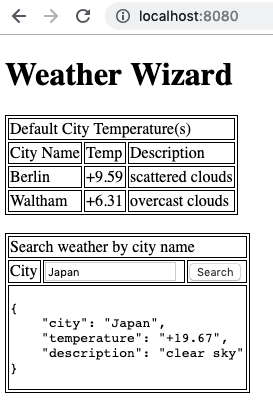

## Weather Wizard - OpenWeatherApi
A proof of concept created in a few hours showing how to integrate OpenWeatherApi with a java-spring boot project.

#### Features:
- It uses free version of https://openweathermap.org/
- Shows weather for default cities at the top (Configurable in property files).
- Type city in textbox and click Search button to see weather results displayed on next line.

#### Screenshot:

#### Future Improvements:
##### FrontEnd
- JQuery autocomplete for city name search box.
- Bootstrap framework to improve the look and make it responsive to screen sizes.
- Possible conversion to PWA (Progressive Web App) so that it caches in browser and works offline.
- Complete overall to React/Redux.

##### BackEnd
- Junit and integration test cases to be added.
- Implement city search box auto-complete support. Partially city list is cached.
- Possibility of weather for cities also being cached once retrieved since weather data does not change frequently.
- Better exception handling.
- Check performance against Jackson json parser instead. Parsing can be improved.
- Hazelcast for caching.
- Create async file logger with rolling file appender. (Currently just console logging done)
